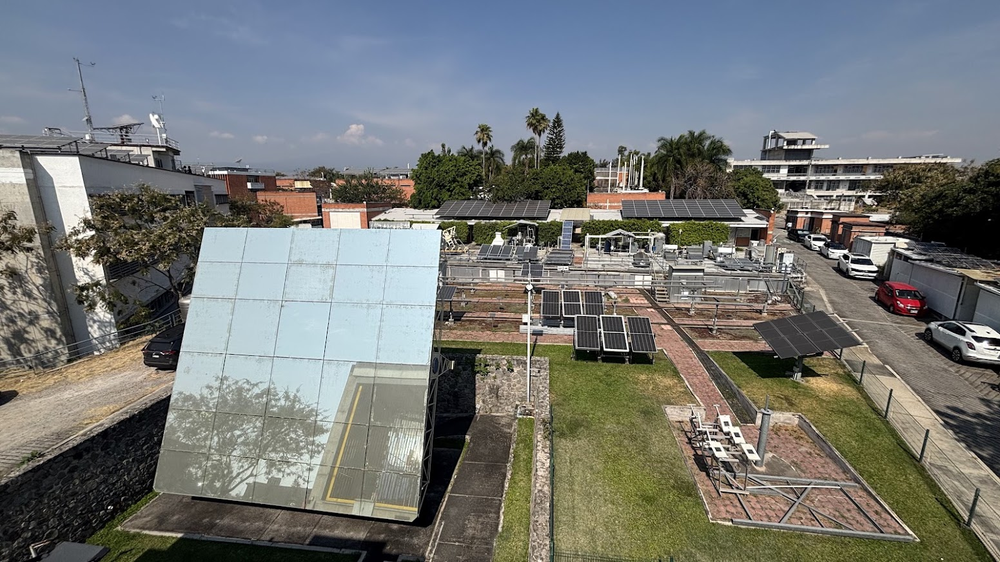
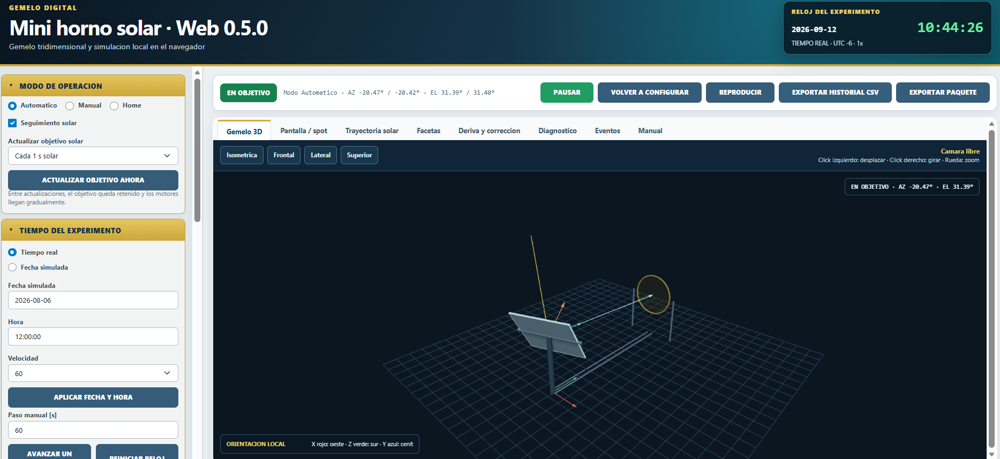
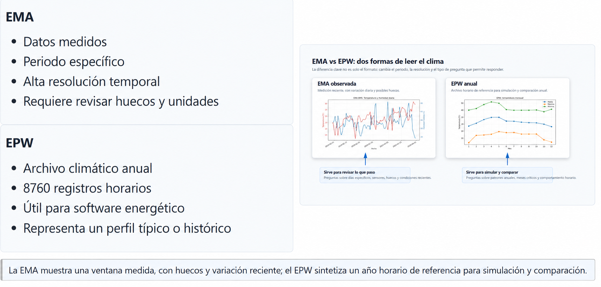

<h3>Solar Heliostat Control and Instrumentation</h3>

Doctoral research at IER-UNAM since 2026, focused on closed-loop heliostat control through sensor-based feedback. The work places primary emphasis on computer vision while considering complementary sensing methods for positioning. The experimental research encompasses the heliostat, solar furnace, instrumentation and control system.

  Doctoral Research
  Control
  Instrumentation

<h3>Interactive Solar Furnace Simulator</h3>

An educational and experimental simulator in development for exploring a solar furnace with a heliostat and faceted concentrator. It integrates solar tracking, reflection geometry, 3D visualization and reproducible experiments with orientation errors and correction strategies. It includes a web version that runs Python directly in the browser and a desktop version written in Python.

  Python
  Shinylive
  Pyodide
  3D Visualization
  In Development

  <a class="btn btn-sm btn-success" href="https://juliolanda.github.io/simulador-horno-solar-web/" target="_blank" rel="noopener">Open Simulator</a>
  <a class="btn btn-sm btn-primary" href="https://github.com/JulioLanda/simulador-horno-solar-web" target="_blank" rel="noopener">Web Repository</a>
  <a class="btn btn-sm btn-outline-primary" href="https://github.com/JulioLanda/simulador-horno-solar" target="_blank" rel="noopener">Base Repository</a>

<h3>IoT_Reloj_Confort</h3>

Open IoT smartwatch and platform for thermal comfort surveys and physiological variables (XIAO ESP32C3, MAX30102, GY‑906, LVGL; ThingsBoard backend).

  C
  ESP32C3
  LVGL
  ThingsBoard

  <a class="btn btn-sm btn-outline-primary" href="publicaciones.html#tesis-reloj" rel="noopener">Thesis</a>
  <a class="btn btn-sm btn-outline-primary" href="publicaciones.html#articulo-reloj" rel="noopener">Article</a>
  <a class="btn btn-sm btn-primary" href="https://github.com/JulioLanda4/IoT_Reloj_Confort" target="_blank" rel="noopener">Repository</a>

<h3>Data Science and Methodology for Climate Analysis</h3>

A 2026 academic workshop with reproducible materials for climate data analysis using automatic weather stations (EMA), EPW files and Jupyter notebooks. It integrates pandas, Plotly, Weather Data, Climate Consultant and EnerHabitat.

  Jupyter
  pandas
  Plotly
  Climate

  <a class="btn btn-sm btn-success" href="https://juliolanda4.github.io/Taller_clima/" target="_blank" rel="noopener">Site</a>
  <a class="btn btn-sm btn-primary" href="https://github.com/JulioLanda4/Taller_clima" target="_blank" rel="noopener">Repository</a>

<h3>Agente_Martin</h3>

A local large language model (LLM) agent developed in Python to maintain and update this Quarto website. It integrates Git, persistent memory, a proposal system before editing and local execution on a Raspberry Pi.

  Python
  LLM
  Quarto
  Raspberry Pi

  <a class="btn btn-sm btn-primary" href="https://github.com/JulioLanda4/Agente_Martin" target="_blank" rel="noopener">Repository</a>

<h3>Lampara_acrilico</h3>

Acrylic craft lamp modeled in SolidWorks. Assemblies/parts (SLDASM/SLDPRT), renders and files for fabrication.

  Open-Source

  <a class="btn btn-sm btn-primary" href="https://github.com/JulioLanda4/Lampara_acrilico" target="_blank" rel="noopener">Repository</a>
  

<h3>Mecanismos</h3>

Collection of cams, mechanisms and a bearing modeled in SolidWorks. Includes assemblies and parts with previews.

  Open-Source

  <a class="btn btn-sm btn-primary" href="https://github.com/JulioLanda4/Mecanismos" target="_blank" rel="noopener">Repository</a>
  

<h3>Microondas_LabVIEW</h3>

“Microwave” project in LabVIEW. Includes VIs/CTLs and project file, with reference images and open instructions.

  LabVIEW

  <a class="btn btn-sm btn-primary" href="https://github.com/JulioLanda4/Microondas_LabVIEW" target="_blank" rel="noopener">Repository</a>
  

<h3>Prenda_generadora</h3>

Wearable energy‑harvesting research project. Evidence, reports, LabVIEW programs, Proteus schematics, data and results.

  Open-Source

  <a class="btn btn-sm btn-primary" href="https://github.com/JulioLanda4/Prenda_generadora" target="_blank" rel="noopener">Repository</a>
  

<h3>Ajuste_Calificaciones</h3>

Quarto site to compute and adjust unit grades; designed for GitHub Pages deployment.

  HTML
  Quarto
  GitHub Pages
  Education

  <a class="btn btn-sm btn-success" href="https://JulioLanda4.github.io/Ajuste_Calificaciones/" target="_blank" rel="noopener">Site</a>
  <a class="btn btn-sm btn-primary" href="https://github.com/JulioLanda4/Ajuste_Calificaciones" target="_blank" rel="noopener">Repository</a>

<h3>Estrategias_bioclimaticas_vivienda</h3>

Bioclimatic design for a semi‑cold dry climate (Pachuca, Mexico). Evaluates passive strategies like absorptance, Low‑e windows and thermal mass to reduce degree‑hours of discomfort.

  HTML
  Bioclimatics

  <a class="btn btn-sm btn-primary" href="https://github.com/JulioLanda4/Estrategias_bioclimaticas_vivienda" target="_blank" rel="noopener">Repository</a>

<h3>MEIA-2023-Portafolio</h3>

Portfolio from the Macro Training in Artificial Intelligence 2023: anomalies, bioinformatics, pollutants, geodata and a final project on Mexico City air quality.

  Jupyter
  AI
  Data

  <a class="btn btn-sm btn-primary" href="https://github.com/JulioLanda4/MEIA-2023-Portafolio" target="_blank" rel="noopener">Repository</a>

<h3>Simulacion_ventilacion_natural</h3>

Natural ventilation simulation in cavities using finite volumes and the SIMPLEC algorithm. Includes Fortran codes, results and report imagery.

  Fortran
  CFD

  <a class="btn btn-sm btn-primary" href="https://github.com/JulioLanda4/Simulacion_ventilacion_natural" target="_blank" rel="noopener">Repository</a>

<h3>Ajedrez-impresion3d</h3>

Chess pieces modeled in SolidWorks, ready for 3D printing (SLDPRT → STL), with reference renders.

  Open-Source

  <a class="btn btn-sm btn-primary" href="https://github.com/JulioLanda4/Ajedrez-impresion3d" target="_blank" rel="noopener">Repository</a>

<h3>Mesa_giratoria_impresion-3d</h3>

Turntable design in SolidWorks for 3D printing, plus electrical diagram in Fritzing. Assemblies/parts (SLDASM/SLDPRT), STL files and assembly imagery.

  Open-Source

  <a class="btn btn-sm btn-primary" href="https://github.com/JulioLanda4/Mesa_giratoria_impresion-3d" target="_blank" rel="noopener">Repository</a>

<h3>Sistema_medicion_apertura_ventanas Private</h3>

Private repository. Role: collaborator. Window opening/closing logging with timestamp for comfort/ventilation studies.

  Hardware
  Firmware
  IoT
  Comfort/Ventilation
  Collaborator

  <a class="btn btn-sm btn-outline-secondary disabled" tabindex="-1" aria-disabled="true">Private repo</a>

<h3>DH2O Private</h3>

Private repository (lata‑mas). Role: collaborator.

  Collaborator
  Private

  <a class="btn btn-sm btn-outline-secondary disabled" tabindex="-1" aria-disabled="true">Private repo</a>

